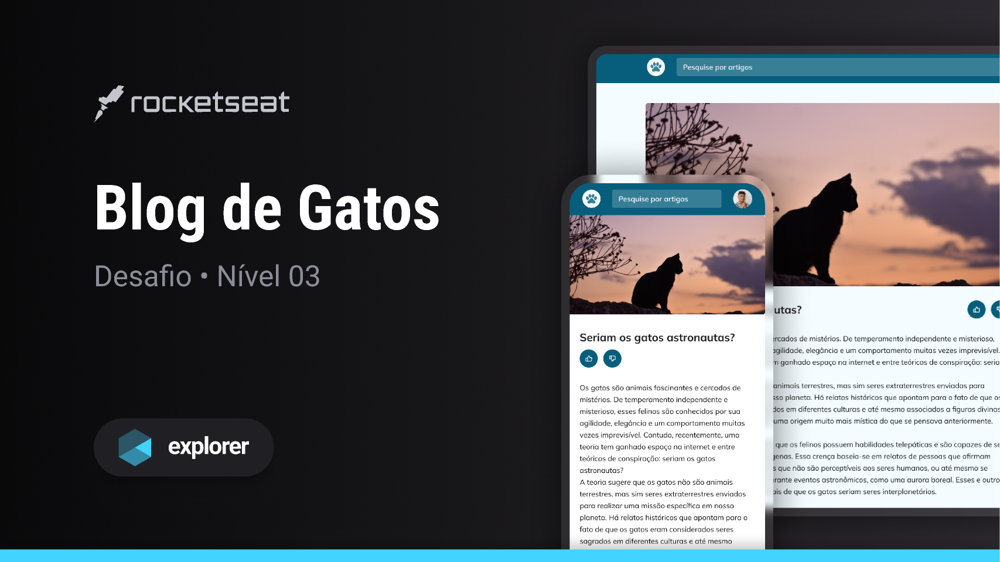
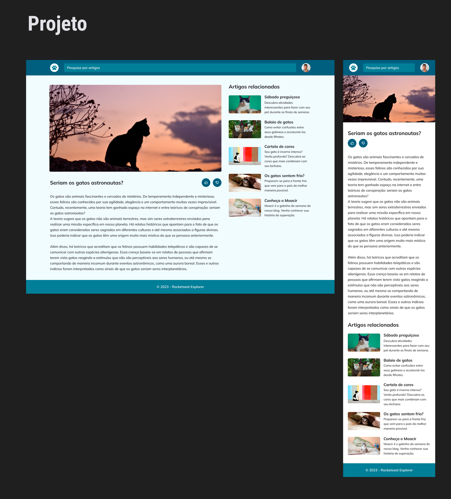

🇧🇷
## 💻 PROJETO
Esse é um blog responsivo sobre gatos, baseado em um layout fornecido pela Rocketseat.

- Mobile First: inicie o projeto deixando-o responsivo em telas menores para depois ajustar para uma versão desktop;
- Unidade de medida flexível;
- Grid;
- Variáveis no CSS;
- Cores HSL;
- Animações e transições simples.

## 🚀 TECNOLOGIAS
Este projeto foi desenvolvido utilizando as seguintes tecnologias:
- HTML
- CSS
- GitHub
- Figma

## 🖌 LAYOUT
Você pode conferir o layout original [clicando aqui](https://www.figma.com/community/file/1256354927622258124).